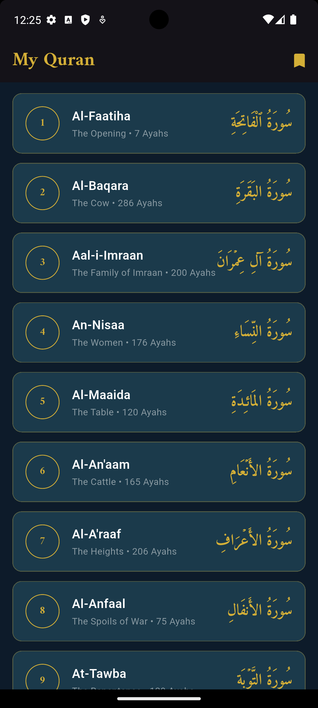
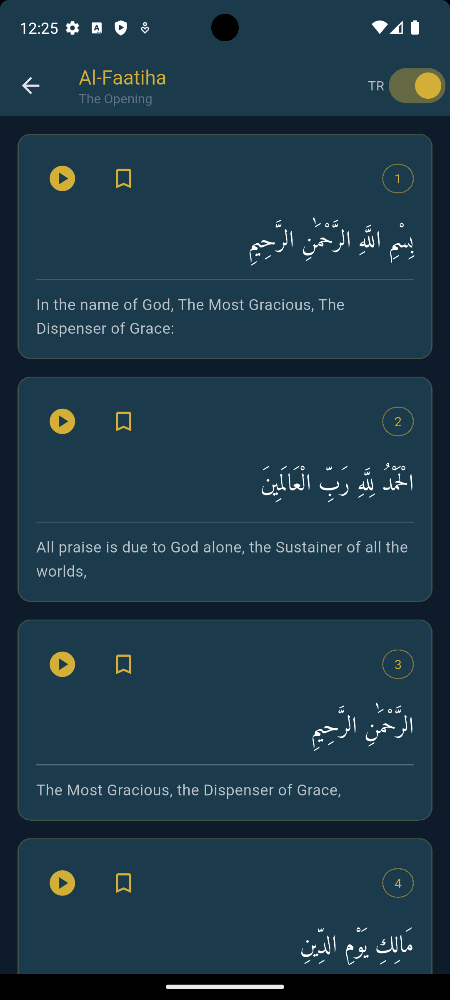
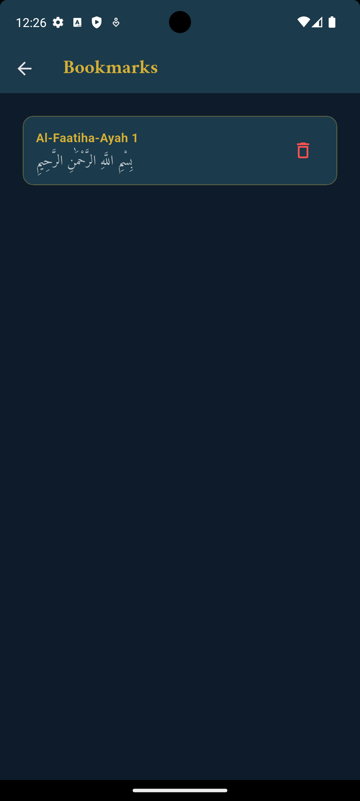

<div align="center">

# 🕌 My Quran

**A beautiful, feature-rich Quran app built with Flutter**


[Features](#-features) • [Screenshots](#-screenshots) • [Installation](#-installation) • [API](#-api-used) • [Project Structure](#-project-structure) 

</div>

---

## ✨ Features

- 📖 **Full Quran** — All 114 Surahs with complete verses
- 🔤 **Arabic Text** — Beautiful Arabic script using the Amiri font
- 🌍 **English Translation** — M. Asad translation with toggle on/off
- 🔊 **Audio Recitation** — Listen to every Ayah with play/pause controls
- 🔖 **Bookmarks** — Save and revisit your favourite Ayahs (persists across sessions)
- 🌙 **Dark Theme** — Elegant navy & gold design, easy on the eyes

---

## 📱 Screenshots


| Home Screen | Surah Detail | Bookmarks |
|:-----------:|:------------:|:---------:|
||| |

---

## 🛠 Tech Stack

| Layer | Technology |
|---|---|
| **Framework** | Flutter 3.41.9 |
| **Language** | Dart 3.11.5 |
| **API** | [Al-Quran Cloud API](https://alquran.cloud/api) |
| **HTTP Client** | `http` package |
| **Audio** | `audioplayers` |
| **Persistence** | `shared_preferences` |
| **Fonts** | `google_fonts` (Amiri) |

---

## 🚀 Installation

### Prerequisites

Make sure you have the following installed:

- [Flutter SDK](https://docs.flutter.dev/get-started/install) (3.0 or above)
- [Android Studio](https://developer.android.com/studio) or [VS Code](https://code.visualstudio.com/)
- An Android/iOS device or emulator

### Steps

1. **Clone the repository**
   ```bash
   git clone https://github.com/deXT-Sadman/my_quran.git
   cd my_quran
   ```

2. **Install dependencies**
   ```bash
   flutter pub get
   ```

3. **Run the app**
   ```bash
   flutter run
   ```

That's it — no API key required! 🎉

---

## 🌐 API Used

This app uses the **[Al-Quran Cloud API](https://alquran.cloud/api)** — free and open, no authentication needed.

| Endpoint | Description |
|---|---|
| `GET /surah` | Fetch list of all 114 Surahs |
| `GET /surah/{id}/editions/quran-simple,en.asad,ar.alafasy` | Fetch Arabic text, English translation, and audio URLs for a Surah |

**Base URL:** `https://api.alquran.cloud/v1`

---

## 📁 Project Structure

```
lib/
├── main.dart                  # App entry point
├── models/
│   ├── surah.dart             # Surah data model
│   └── ayah.dart              # Ayah data model
├── services/
│   └── quran_service.dart     # All API calls
├── screens/
│   ├── home_screen.dart       # Surah list screen
│   ├── surah_detail_screen.dart  # Verse-by-verse reading
│   └── bookmarks_screen.dart  # Saved bookmarks
├── widgets/
│   ├── surah_card.dart        # Reusable Surah list item
│   └── ayah_tile.dart         # Reusable Ayah card with audio & bookmark
└── utils/
    └── bookmark_manager.dart  # SharedPreferences bookmark logic
```

---

## 📦 Dependencies

```yaml
dependencies:
  flutter:
    sdk: flutter
  http: ^1.2.1              # REST API calls
  audioplayers: ^6.1.0      # Audio recitation playback
  shared_preferences: ^2.3.2 # Persistent bookmark storage
  google_fonts: ^6.2.1      # Amiri Arabic font
```

---

## 🤝 Contributing

Contributions, issues, and feature requests are welcome!

1. Fork the project
2. Create your feature branch (`git checkout -b feature/AmazingFeature`)
3. Commit your changes (`git commit -m 'Add some AmazingFeature'`)
4. Push to the branch (`git push origin feature/AmazingFeature`)
5. Open a Pull Request

---

## 🗺 Roadmap

- [ ] Search Surahs by name
- [ ] Last read position memory
- [ ] Prayer times integration
- [ ] Multiple translations support
- [ ] Offline mode with local caching
- [ ] Light / dark theme toggle

---

## 📄 License

Distributed under the MIT License. See `LICENSE` for more information.

---

<div align="center">

Made with ❤️ by [deXT-Sadman](https://github.com/deXT-Sadman)

⭐ Star this repo if you found it useful!

</div>
